# MartinsCloud Website


**Personal Website & Portfolio Project**  
Built with **Python, Flask, HTML, CSS, Bootstrap**, and deployed on **AWS** with a fully automated, scalable, and secure architecture. All infrastructure was provisioned via **CloudFormation YAML scripts**, giving me full control over the environment.

---

## 🌐 Live Demo
[https://www.martinscloud.be](https://www.martinscloud.be)

---

## 🔧 Technologies & Tools

- **Frontend:** HTML, CSS, Bootstrap, JavaScript  
- **Backend:** Python, Flask, Flask-Login, Flask-CKEditor  
- **Database:** MySQL (Amazon RDS) with IAM authentication  
- **Infrastructure / DevOps:** AWS CloudFormation, EC2, RDS, VPC, Subnets, Security Groups, Route 53, ACM, Auto Scaling, ALB  
- **Server & Deployment:** Gunicorn, Nginx, systemd, HTTPS  
- **Design Tools:** Canva, Paint, ChatGPT  
- **Version Control:** Git, GitHub  

---

## 📋 Project Overview

**MartinsCloud** is my personal portfolio website showcasing my cloud engineering and software development projects. This project demonstrates:

- **Full-stack web development** with Flask and Bootstrap  
- **Custom graphics and logos** created by myself  
- **Database integration** with Amazon RDS and secure IAM authentication  
- **Scalable and resilient AWS architecture** spanning multiple availability zones  
- **Automated infrastructure deployment** with CloudFormation YAML scripts  

**Advanced Deployment Note:**  
Unlike the previous Blackjack project where I relied on **Elastic Beanstalk**, this project was deployed entirely on a **self-configured VPC** with **private and public subnets, route tables, IGW**. All resources were provisioned and version-controlled using **CloudFormation**, demonstrating end-to-end AWS expertise, scaling, and security without relying on managed deployment tools.  

---

## 🛠 Features

- Interactive blog platform with authentication, CRUD posts, and comments  
- Responsive layout with emphasis on desktop usability
- Fully integrated **MySQL RDS database** replacing local SQLite  
- Scalable and resilient deployment with **Auto Scaling & ALB**  
- Multi-app routing: MartinsCloud homepage and Blackjack app on the same ALB  
- Secure traffic via **HTTPS with automatic redirection from HTTP**  

---

## 💻 Local Development Setup

The project uses **AWS RDS with IAM authentication** in production. To run locally, you have two options:


### Option 1: Connect to RDS
- Configure AWS CLI credentials:
```bash
aws configure
```
- Ensure your IP is allowed in the RDS security group
- Install RDS SSL certificate bundle locally
- Run the Flask app:

```bash
python main.py
```
### Option 2: Run Locally with SQLite (for testing)
- Set environment variable:
```bash
export FLASK_ENV=development
```
- Modify main.py:
```bash
if os.environ.get("FLASK_ENV") == "development":
    app.config['SQLALCHEMY_DATABASE_URI'] = "sqlite:///local.db"
```
- Run Flask locally:
```bash
flask run
```
⚠️ Note: Some RDS-specific features like IAM authentication will not work in local SQLite mode.  

---

## Installation 
1. Clone the repository
```bash
git clone https://github.com/MartijnMGit/MartinsCloud.git
cd MartinsCloud
```
2. Create a virtual environment
```bash
python3 -m venv venv
source venv/bin/activate  # Linux/Mac
venv\Scripts\activate     # Windows
```
3. Install requirements
```bash
pip install -r requirements.txt
```
4. Run the Flask app
```bash
python main.py
```
- In development mode, visit: http://127.0.0.1:5001/
- In production (RDS/EC2), the app runs on the configured public IP or domain.

---

## 🛠️ Tech Stack

- Frontend: HTML5, Bootstrap 5, CSS, CKEditor
- Backend: Python 3, Flask, SQLAlchemy, Flask-Login, Flask-Gravatar
- Database: AWS RDS MySQL with IAM authentication
- Cloud & DevOps: EC2, VPC, ALB, Auto Scaling, Route 53, ACM SSL, CloudFormation
- Version Control: Git & GitHub

---

## ✨ Highlights & Challenges

- Fully manual VPC setup with private/public subnets, route tables, IGW, and security groups
- AWS IAM authentication for RDS instead of traditional username/password
- Running Flask app in production with Gunicorn + systemd and Nginx
- Multi-AZ scalable architecture with ALB and ASG
- Redeployed existing Blackjack project on the same self-configured VPC to reuse the ALB, as cross-VPC routing is not possible
- Hands-on CloudFormation YAML scripting for reproducible infrastructure
💡 Previous projects used Elastic Beanstalk for deployment. This project intentionally avoids it, proving mastery of full AWS architecture and automation.

---

## 🔑 Key Takeaways

This project showcases:

- Full-stack web development with Flask and Python
- Cloud infrastructure design and deployment on AWS
- Security best practices: IAM, SSL, secure database access
- Scalable, resilient architecture using multiple AZs
- Ability to take a project from local development → production in the cloud
- Strong design sense with custom graphics and UI polish

---

## 📸 Screenshots

### 1. Homepage / About Me
Showcasing custom headers with picture.


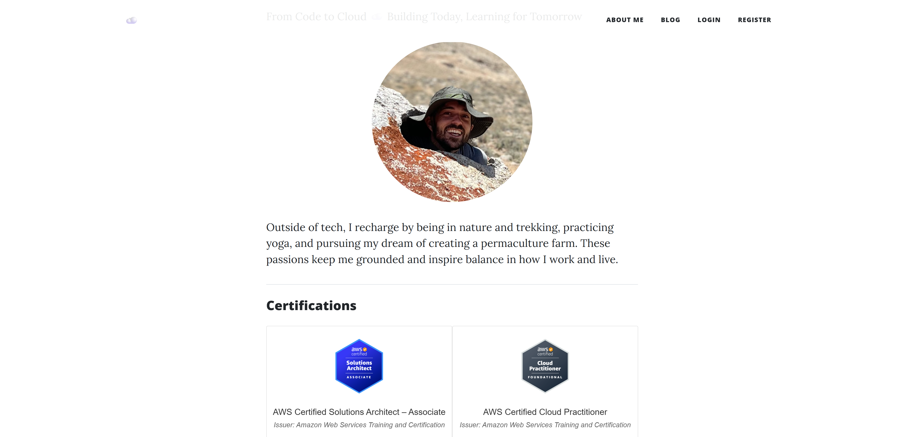

### 2. Blog Page
Listing posts with titles, subtitles, and images.

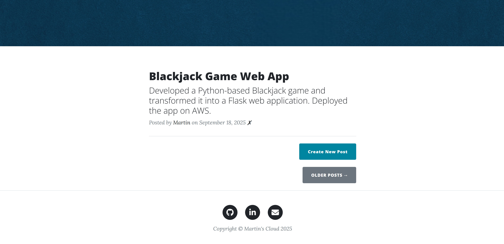

### 3. Single Post with Comments
Demonstrates comment section and Gravatar integration.


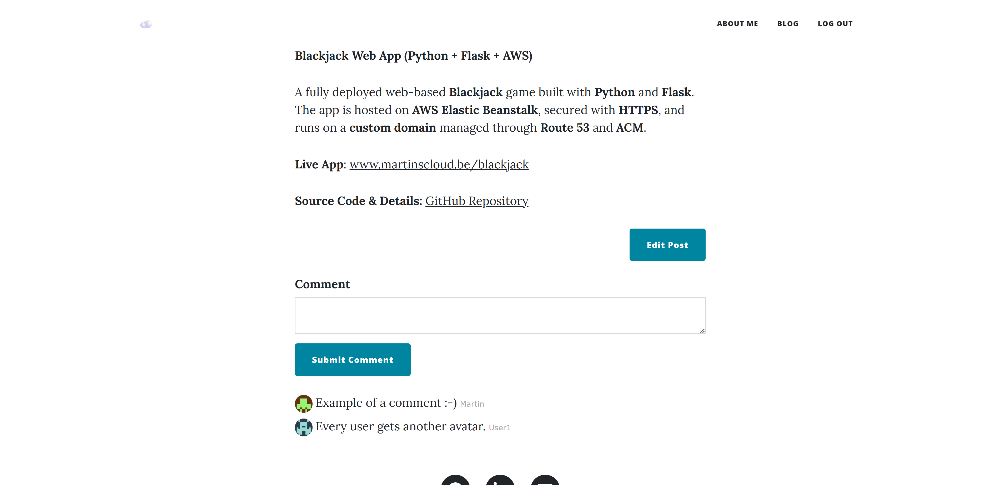

### 4. Admin Features
- Create Post form  

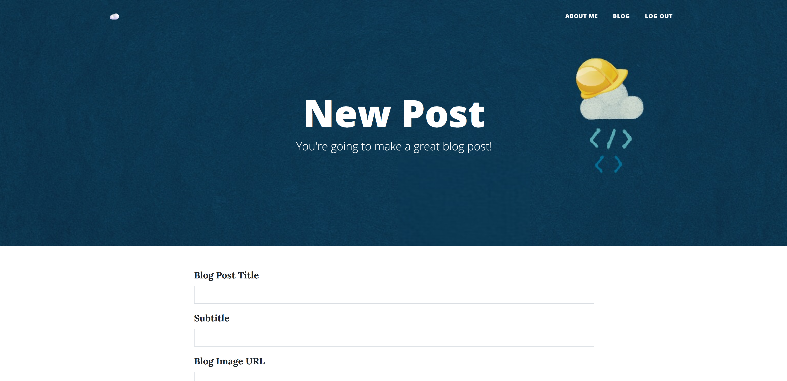
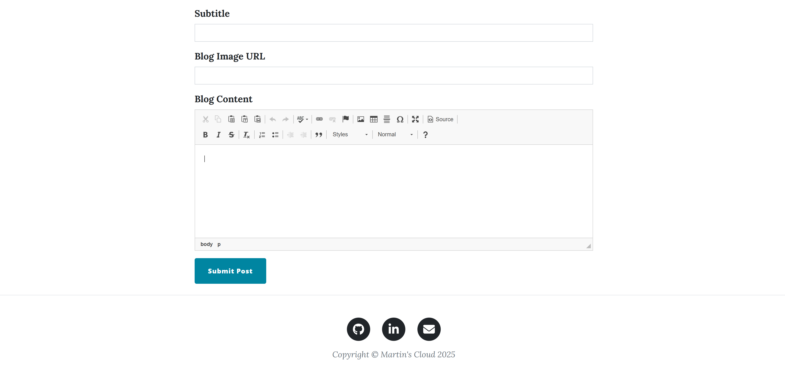

### 5. Cloud / Deployment Evidence
- EC2 instance running the Flask app  
- RDS dashboard with IAM authentication  
- ALB routing rules and HTTPS setup

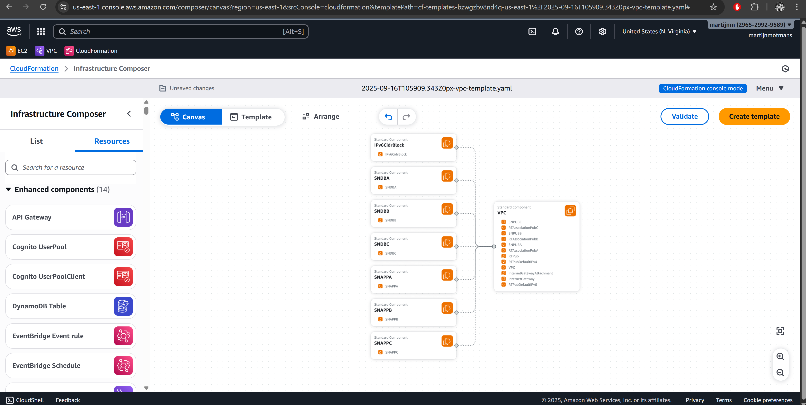
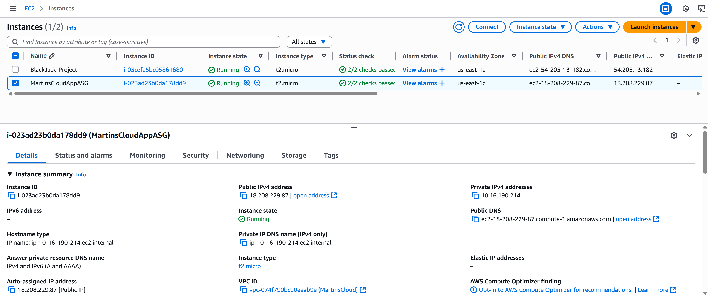
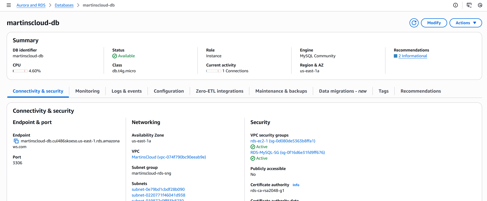
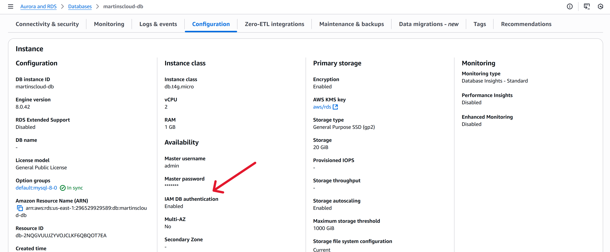
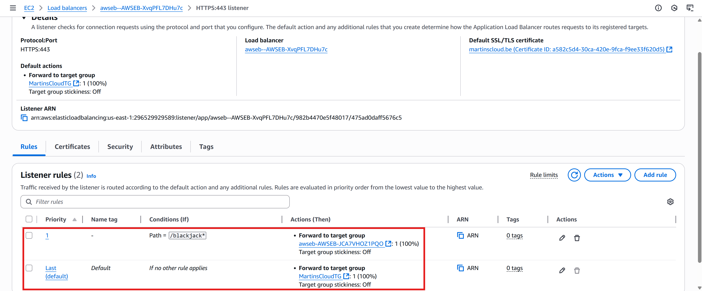
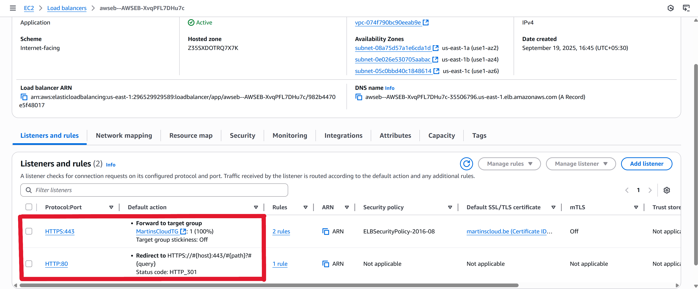
