# MartinsCloud Website

**Personal Website & Portfolio Project**  
Built with **Python, Flask, HTML, CSS, Bootstrap**, and deployed on **AWS** with a fully automated, secure, and cost-optimised architecture.

🌐 **Live:** https://www.martinscloud.be

---

## 🔄 v2 – Infrastructure Migration (May 2026)

After running the original architecture for several months, I identified significant cost inefficiencies and performed a full infrastructure migration. This section documents what changed, why, and how.

### Why I Migrated

| Problem | Impact |
|---------|--------|
| RDS MySQL (us-east-1) | ~€25/month idle cost |
| ALB with 3 Elastic IPs | ~€18/month unnecessary charge |
| ACM cert tied to ALB | No direct EC2 HTTPS without ALB |
| Custom VPC (CloudFormation) | Maintenance overhead for single-instance app |
| Region: us-east-1 | Higher latency for European visitors |

**Total before: ~€51/month → After: ~€8.50/month (83% cost reduction)**

---

### What Changed

#### 1. Region Migration: us-east-1 → eu-west-3 (Paris)
- Created an AMI snapshot of the existing EC2 instance
- Copied the AMI cross-region to eu-west-3 via AWS Console
- Launched new EC2 instance from the copied AMI in Paris
- Allocated new Elastic IP in eu-west-3 and attached it
- Updated Route53 A records to point to the new Elastic IP
- **Result:** Lower latency for European users, GDPR-friendly region

#### 2. Database Migration: RDS MySQL → SQLite
- Exported all blog data from RDS MySQL
- Imported data into SQLite on the new EC2 instance
- Removed all RDS-specific code: IAM token generation, SSL cert config, PyMySQL driver
- SQLAlchemy's `db.create_all()` automatically creates the schema on first run

```python
# Before
app.config['SQLALCHEMY_DATABASE_URI'] = get_db_uri()  # RDS MySQL + IAM auth

# After
app.config['SQLALCHEMY_DATABASE_URI'] = 'sqlite:///blog.db'
```

#### 3. Secrets: SSM Parameter Store (kept & updated)
- Kept AWS SSM Parameter Store for secret key — no secrets in code or on disk
- Recreated `/SECRET_KEY` parameter in eu-west-3
- EC2 IAM role updated with `AmazonSSMReadOnlyAccess`

```python
def get_secret_key():
    ssm = boto3.client('ssm', region_name='eu-west-3')
    response = ssm.get_parameter(Name='/SECRET_KEY', WithDecryption=True)
    return response['Parameter']['Value']
```

#### 4. Removed ALB + ASG
- Replaced ALB/ASG with direct Route53 → EC2 routing
- Single t3.micro is sufficient for portfolio traffic
- Eliminated the largest recurring hourly charges

#### 5. Removed Custom VPC
- Migrated to default VPC in eu-west-3
- Deleted CloudFormation stack, cleaning up all custom VPC resources automatically

#### 6. HTTPS: ACM → Let's Encrypt (Certbot)
- ACM certificates only work with ALB/CloudFront, not directly on EC2
- Replaced with free Let's Encrypt certificate via Certbot
- Auto-renews every 90 days via systemd timer

```bash
sudo certbot --nginx -d martinscloud.be -d www.martinscloud.be
sudo systemctl enable certbot-renew.timer
```

---

### v2 Architecture

```
User
 │
 ▼
Route53 (A record) → Elastic IP
 │
 ▼
EC2 t3.micro (eu-west-3, Paris)
 ├── Nginx (reverse proxy + SSL via Let's Encrypt)
 ├── Gunicorn (4 workers, systemd service — auto-starts on reboot)
 ├── Flask app (Python 3.9)
 │    ├── SQLite (blog.db)
 │    └── boto3 → SSM Parameter Store (secret key)
 └── IAM Role → SSM read access
```

### v2 Security Group

| Port | Source | Purpose |
|------|--------|---------|
| 80 | 0.0.0.0/0 | Let's Encrypt verification + HTTP redirect |
| 443 | 0.0.0.0/0 | HTTPS traffic |
| 22 | My IP only | SSH admin access |

### v2 Cost Comparison

| Component | v1 (Before) | v2 (After) |
|-----------|-------------|------------|
| RDS MySQL | ~€25/month | €0 (SQLite) |
| ALB | ~€18/month | €0 (removed) |
| ACM | €0 | €0 (Let's Encrypt) |
| EC2 t3.micro | ~€8/month | ~€8/month |
| Route53 | ~€0.50/month | ~€0.50/month |
| **Total** | **~€51/month** | **~€8.50/month** |

---

## 🔧 Technologies & Tools

**v1 (Original):**
- **Frontend:** HTML, CSS, Bootstrap, JavaScript
- **Backend:** Python, Flask, Flask-Login, Flask-CKEditor
- **Database:** MySQL (Amazon RDS) with IAM authentication
- **Infrastructure:** AWS CloudFormation, EC2, RDS, VPC, Subnets, Security Groups, Route53, ACM, Auto Scaling, ALB
- **Server:** Gunicorn, Nginx, systemd, HTTPS
- **Version Control:** Git, GitHub

**v2 (Current):**
- All of the above except RDS, ALB, ASG, ACM, and custom VPC
- **Database:** SQLite (via SQLAlchemy)
- **SSL:** Let's Encrypt (Certbot)
- **Region:** eu-west-3 (Paris)
- **Networking:** Default VPC

---

## 📋 Project Overview

**MartinsCloud** is my personal portfolio website showcasing my cloud engineering and software development projects. This project demonstrates:

- **Full-stack web development** with Flask and Bootstrap
- **Custom graphics and logos** created by myself
- **Database integration** — first with Amazon RDS + IAM auth, later migrated to SQLite for cost efficiency
- **Production-grade AWS infrastructure** — including a full migration between regions and architectures
- **Automated infrastructure deployment** with CloudFormation YAML scripts (v1)
- **Cost optimisation** — reduced monthly AWS spend by 83% without sacrificing functionality

**Advanced Deployment Note (v1):**  
Unlike the previous Blackjack project where I relied on **Elastic Beanstalk**, the original deployment used a **self-configured VPC** with private and public subnets, route tables, and IGW. All resources were provisioned and version-controlled using **CloudFormation**, demonstrating end-to-end AWS expertise without relying on managed deployment tools.

---

## 🛠 Features

- Interactive blog platform with authentication, CRUD posts, and comments
- Responsive layout with emphasis on desktop usability
- Role-based access control (admin-only post management)
- Gravatar integration for user profile images
- Rich text editor via Flask-CKEditor
- Playable Blackjack game with session-based game state
- Secure traffic via HTTPS with automatic HTTP → HTTPS redirection

---

## 💻 Local Development Setup

```bash
git clone https://github.com/MartijnMGit/MartinsCloud.git
cd MartinsCloud
python3 -m venv venv
source venv/bin/activate  # Linux/Mac
venv\Scripts\activate     # Windows
pip install -r requirements.txt
python main.py
```

Visit: http://127.0.0.1:5001/

> Note: SSM Parameter Store is used for the secret key in production. For local development, you can temporarily replace `app.secret_key = get_secret_key()` with a static string.

---

## ✨ Highlights & Challenges

**v1:**
- Fully manual VPC setup with private/public subnets, route tables, IGW, and security groups
- AWS IAM authentication for RDS instead of traditional username/password
- Multi-AZ scalable architecture with ALB and ASG
- Custom AMI + Launch Template with user data to automatically pull latest code on scale-out events
- Hands-on CloudFormation YAML scripting for reproducible infrastructure
- Merged Blackjack app into main Flask project, reusing existing ALB

**v2 (Migration):**
- Cross-region AMI copy and instance migration with zero data loss
- RDS → SQLite migration preserving all existing blog data
- Replaced ACM (ALB-only) with Let's Encrypt directly on EC2
- Configured Gunicorn as a systemd service for auto-restart on reboot
- Reduced monthly AWS cost by 83% while keeping the site fully functional and secure

---

## 🔑 Key Takeaways

- Full-stack web development with Flask and Python
- Cloud infrastructure design, deployment, and migration on AWS
- Security best practices: IAM roles, SSL/TLS, SSH restricted to known IPs, secrets via SSM
- Cost awareness — knowing when managed services add value vs. when they add unnecessary spend
- Scalable architecture (v1) and lean single-instance production setup (v2)
- Multi-app integration and application-level routing
- Ability to take a project from local development → production → optimised production

---

## 📸 Screenshots

### Homepage / About Me


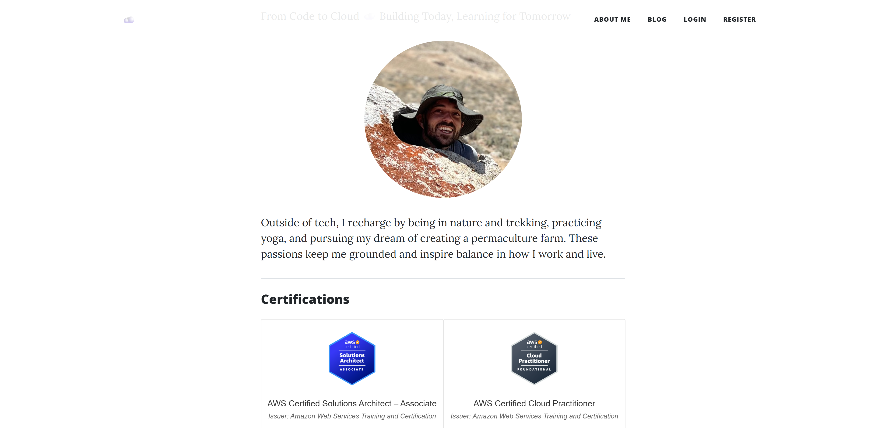

### Blog Page
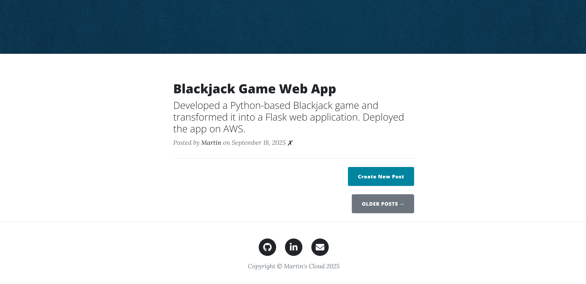

### Single Post with Comments

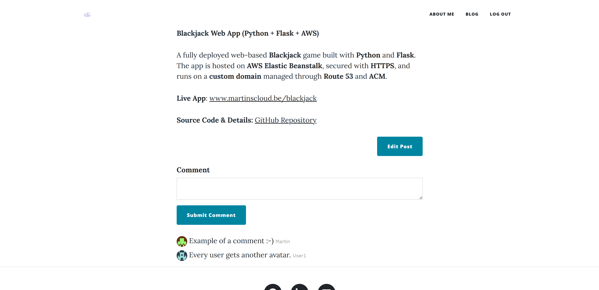

### Register and Log In
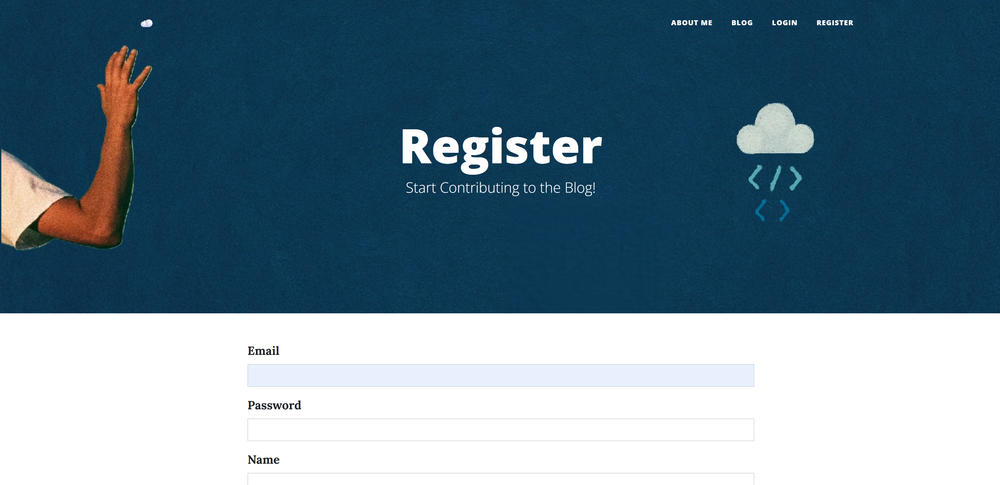


### Admin Features
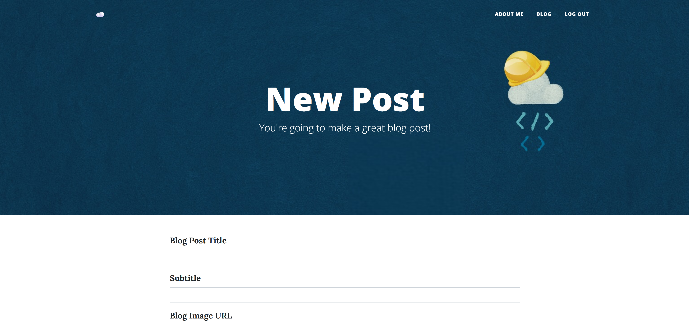
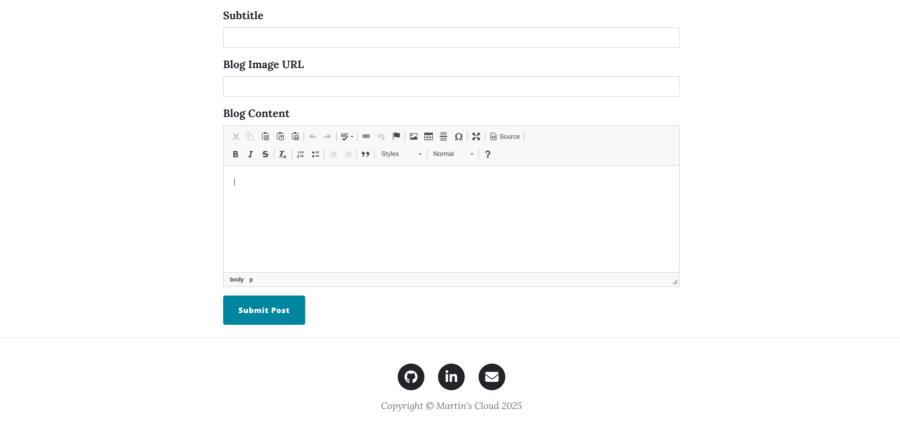

### Cloud / Deployment Evidence (v1)
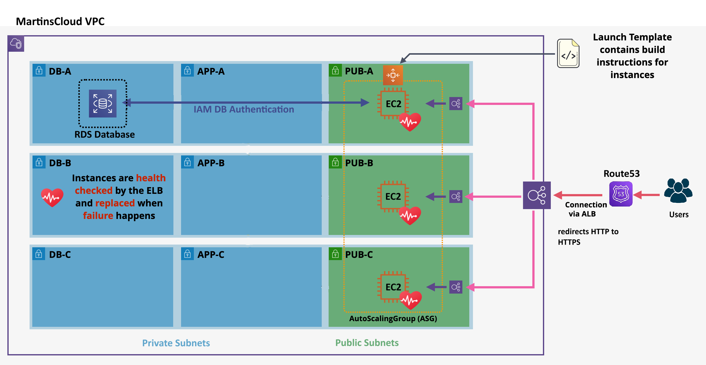
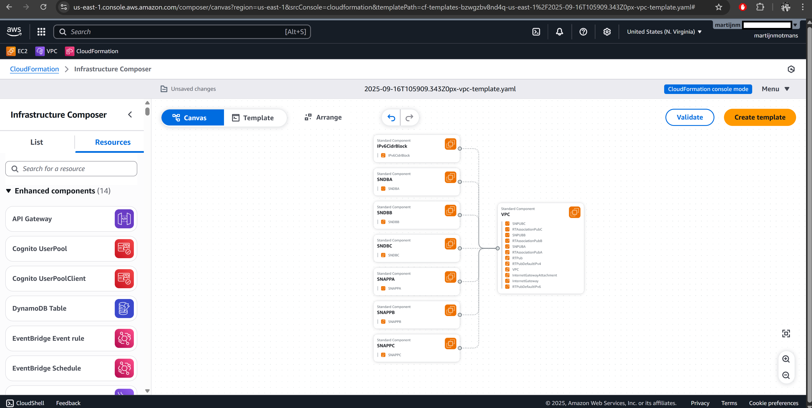
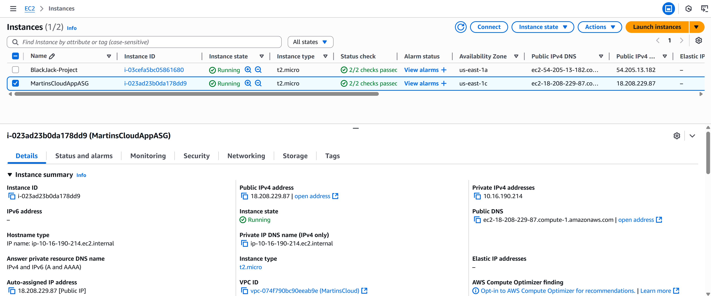
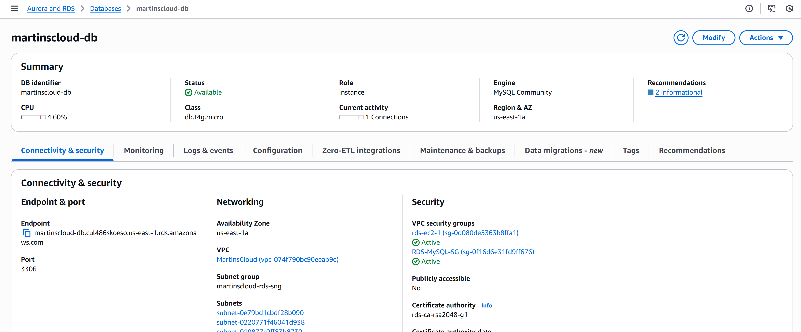
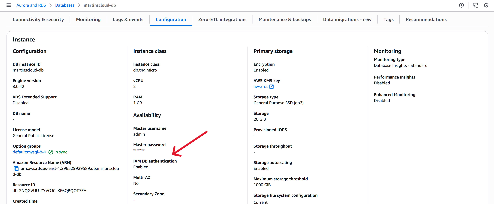
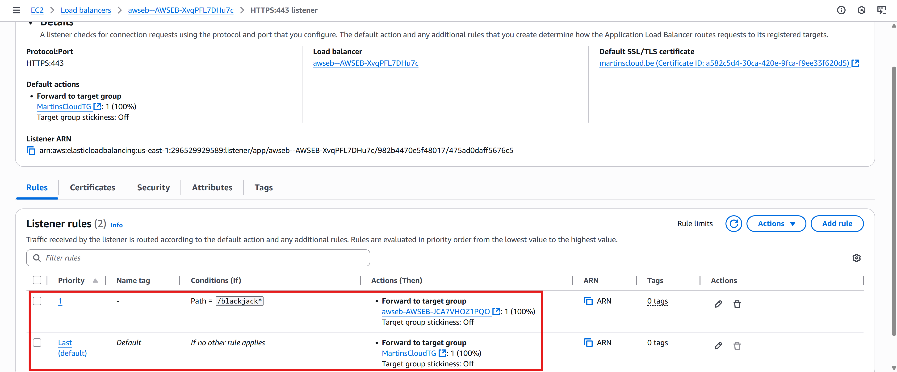
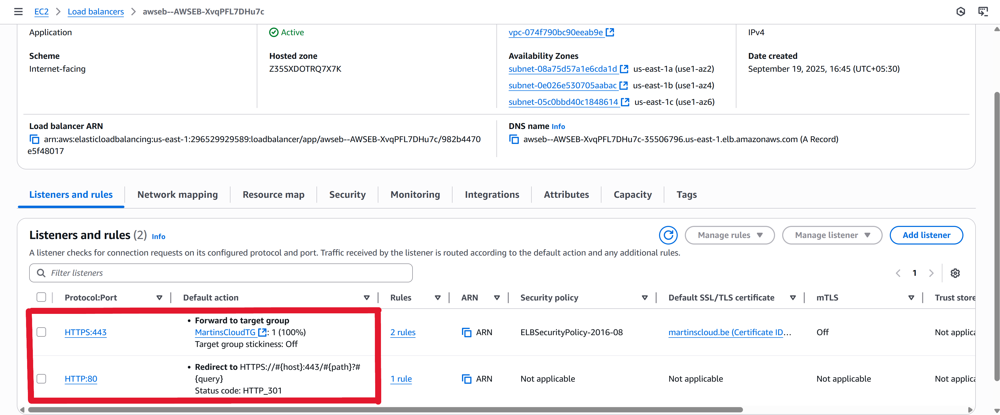
